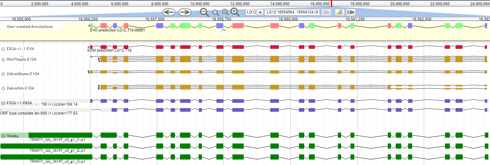

 

# ESGA - Genome Annotation (v2)

This project is under active development - it may not work for all possible use cases yet. 

 or higher

or 

This pipeline peforms annotation of novel genomes using a combination of evidence alignments, evidence-based gene building and ab-initio gene building.

It does not constitute a novel algorithm per se but combines many well-established tools into an easy-to-use "one click" solution that is accessible even to inexperienced users. 

### Pipeline main steps

The minimum requirements are a genome file and at least one type of evidence.

From this, the pipeline will align evidences, compute synteny maps, perform repeat masking, model training and subsequent gene building using one or several tools. A full description is available [here](docs/pipeline.md).

### Results

ESGA produces Gmod compliant data tracks, including annotations and alignments. These can be used as-is or taken as input for e.g. manual curation. 

ESGA outputs, visualized using WebApollo. In addition to novel gene builds (red), ESGA can optionally produce transcriptome-based gene models (purple) or lift-over annotations from distantly related organisms (orange) to help guide the curation effort. 

### Test data

A simple test data set can be downloaded [here](https://drive.google.com/open?id=1VFqLnRJiuj5Vhj2KCOdY58jwxZKkkMVU)

### Documentation

Documentation about the pipeline can be found in the `docs/` directory or under the links below:

1. [What happens in this pipeline?](docs/pipeline.md)
2. [Recommendations](docs/recommendations.md)
3. [Installation and configuration](docs/installation.md)
4. [Running the pipeline](docs/usage.md)
5. [Output](docs/output.md)
6. [Troubleshooting](docs/troubleshooting.md)
7. [What's next](docs/whatsnext.md)
8. [Citations](docs/citations.md)

### Why ESGA?

ESGAs' implementation was motivated by our need for a "fully contained" annotation solution that uses current programming paradigms and structures to rapidly annotate a metazoan genome. For us, this means: modular, open code as well as support
for a range of popular schedulers to translate the workflow to a compute farm. In addition, we wanted to support input data that is missing from some other available solutions - including raw RNAseq reads and related genomes/annotations to lift-over
annotations from other model systems. Finally, we wanted all of this to be usable without having to go through lengthy (and often rather painful) installation procedures for a host of software tools. ESGA uses a small number of docker 
containers to deliver all the required dependencies. In our experience, this solves some of the main issues people typically experience when trying to annotate a genome.

All you need to do is write a small config file and provide singularity/docker support on your cluster. Done. 

### Credits

This pipeline was written by Dr. Montserrat Torres ([MontseTor](https://github.com/MontseTor)) and Dr. Marc Höppner ([marchoeppner](https://github.com/marchoeppner)) at [IKMB](http://www.ikmb.uni-kiel.de).
The authors gratefully acknowledge inspiration, fruitful discussions and a few useful code snippets from the [nf-core](https://www.nf-co.re).

