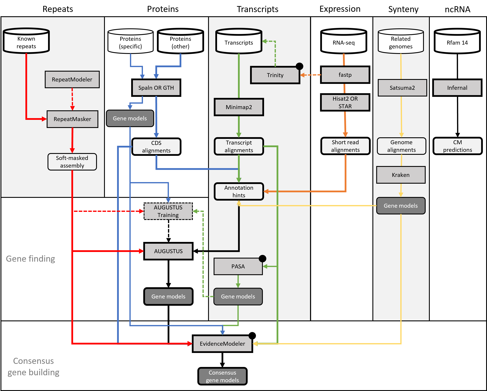

## What happens in this pipeline?

This pipeline accepts a genome assembly and a range of sequence inputs from which so-called gene builds are computed - often also referred to as 'annotations'.

These correspond to the structure of different (protein-coding) genes in your assembly and can inform a wide range of scientific questions - from gene evolution to disease studies. 

Please note that any computational gene build is prone to a wide range of errors, stemming from noise in the input data as well as limitations in the prediction algorithms. The more obscure the organism, the harder it will
likely be to achieve a highly sensitive annotation in just "one go". 

In any case, the product of this (or any other) annotation pipeline is a best-guess interpretation and will require manual curation to achieve the best possible result suitable for highly detailed genetic/genomic studies.

The resulting data will be processed by annotation "engines" (AUGUSTUS, Pasa and EvidenceModeler) and produce distinct gene builds for each of these tools.

All of the data types and tools are optional, with the expception of AUGUSTUS. More information on this is available from the [usage](usage.md) instructions.

 
